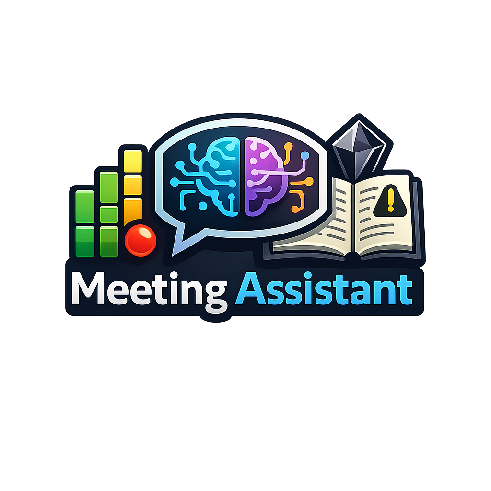

<p align="center">
  
</p>

# Meeting Assistant

Meeting Assistant is a high-performance terminal application that transforms spoken conversations into structured knowledge. It combines real-time local transcription with deep AI analysis to generate professional reports, visual mind maps, and insights tailored to your specific professional role.

## Why Meeting Assistant?

Manual note-taking is a cognitive burden that distracts from active participation. Meeting Assistant solves this by:

1.  **Eliminating Cognitive Load**: Focus entirely on the conversation while the AI handles the documentation.
2.  **Role-Specific Filtering**: Specialized personas (Dev, PM, Exec) ensure you only get the insights relevant to your role.
3.  **Truly Offline & Private**: Speech-to-text is powered by `whisper.cpp` and happens **entirely offline** on your machine. Your raw audio never leaves your local environment.
4.  **Flexible AI Intelligence**: Use high-performance cloud models (Gemini, OpenAI) or maintain a **100% offline workflow** by connecting to a local `Ollama` instance.

---

## Real-World Examples

### 1. The Daily Standup (Persona: PM)
Focus on identifying blockers and ensuring the timeline is on track.
```bash
# Start a session focused on deliverables and blockers
meeting_assistant -l --ui -p gemini --persona pm
```

### 2. Technical Architecture Review (Persona: Dev + Research)
Focus on capturing complex logic and fact-checking external libraries.
```bash
# Capture technical details and research mentioned libraries/APIs
meeting_assistant -l --ui -p gemini --persona dev --research
```

### 3. Fully Offline Confidential Meeting (Persona: General + Ollama)
When privacy is paramount, run everything on your own hardware.
```bash
# Local transcription + Local LLM analysis
meeting_assistant -l --ui -p ollama -L llama3
```

---

## Core Capabilities

### Active Intelligence
*   **Live AI Copilot**: Press [Space] during a meeting to query the AI about the current context.
*   **Contextual Continuity**: Whisper retains a rolling memory of the last 200 characters to maintain accuracy across ongoing sentences.
*   **Visual Mapping**: Every meeting generates a Mermaid.js diagram to visualize topics and decisions.

### Seamless Integration
*   **Obsidian v3**: Notes use modern Properties and semantic callouts to integrate directly into your second brain.
*   **Standalone HTML**: Generates tidy, CSS-styled reports perfect for sharing via email or Slack.

---

## Installation

### Prerequisites
*   **CMake**: 3.14 or higher.
*   **PortAudio**: Required for live microphone input (`brew install portaudio` on macOS).

### 1. Download Whisper Model
The application requires a Whisper model in `ggml` format. You can download these from the [whisper.cpp HuggingFace repository](https://huggingface.co/ggerganov/whisper.cpp/tree/main).

| Model | Size | Speed | Accuracy | Recommended For |
| :--- | :--- | :--- | :--- | :--- |
| **tiny.en** | 75 MB | Fastest | Lowest | Low-power devices / Real-time testing |
| **base.en** | 142 MB | Very Fast | Good | Standard laptops / Most meetings |
| **small.en**| 466 MB | Fast | Great | High-accuracy requirements |
| **medium.en**| 1.5 GB | Slow | Excellent | Post-meeting batch processing |
| **large-v3** | 2.9 GB | Slowest | State-of-the-art | Maximum precision (requires GPU/Metal) |

**Quick Download (Base Model):**
```bash
mkdir -p models
curl -L https://huggingface.co/ggerganov/whisper.cpp/resolve/main/ggml-base.en.bin -o models/ggml-base.en.bin
```

### 2. Build
```bash
mkdir build && cd build
cmake -DCMAKE_PREFIX_PATH=/opt/homebrew ..
make
sudo make install
```

## Dashboard Hotkeys
*   **[Space]**: Open AI Copilot to ask a question during the meeting.
*   **[N]**: Finalize current session and start a New Meeting immediately.
*   **[Q / ESC]**: Save all reports and Quit.

## Configuration
Settings are persisted in `~/.meeting_assistant/config.json`. Update your default vault path or API keys using the `--save-config` flag.

## License
Apache License 2.0 - See `LICENSE` for details.
